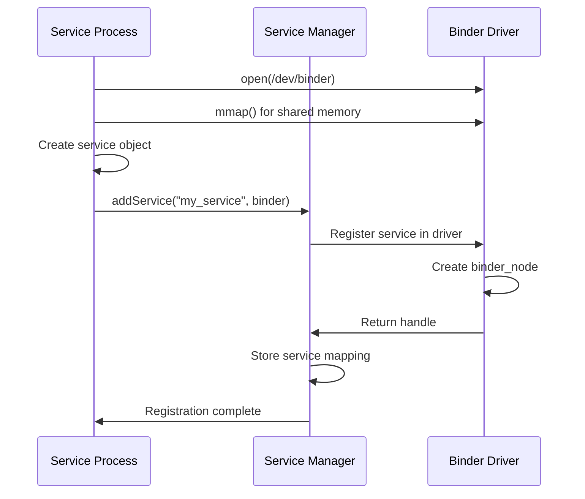
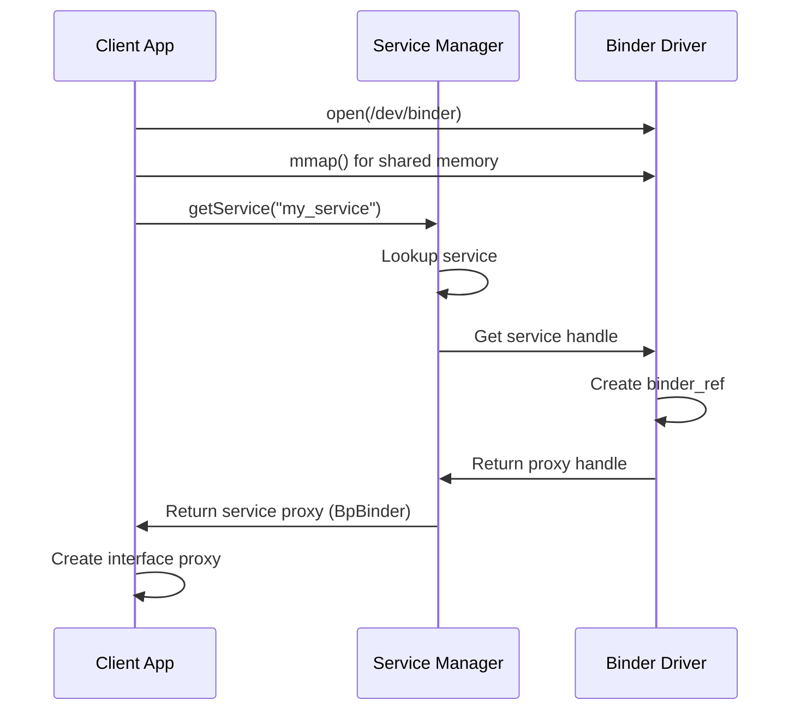
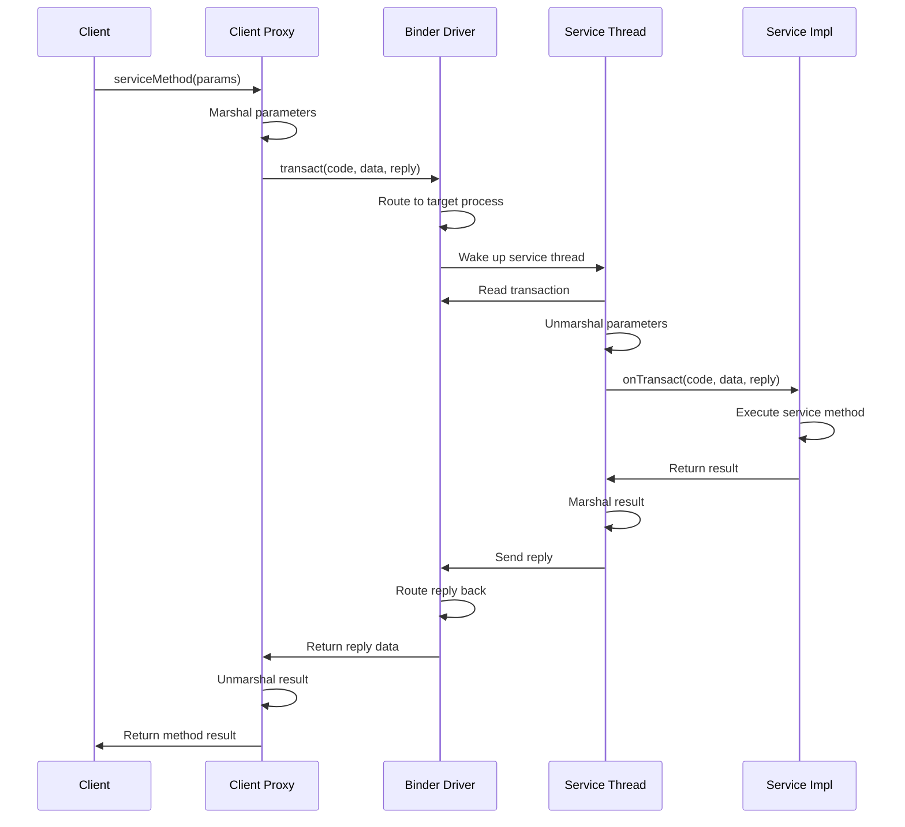
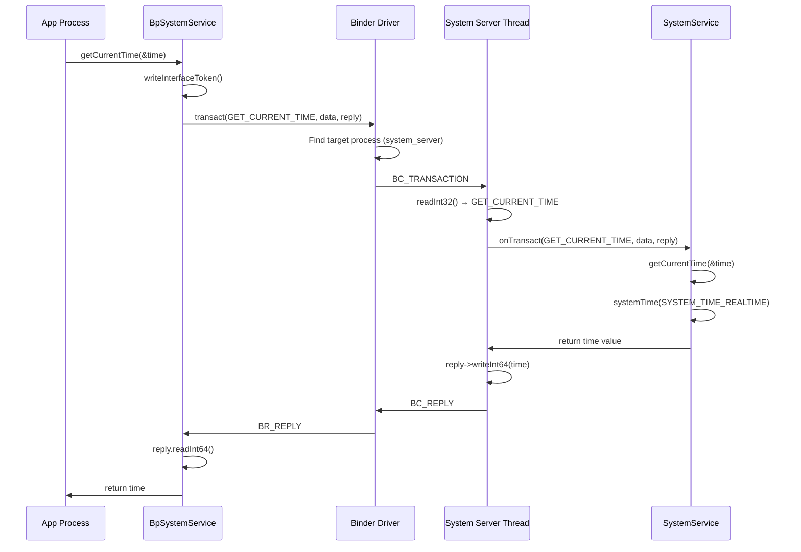
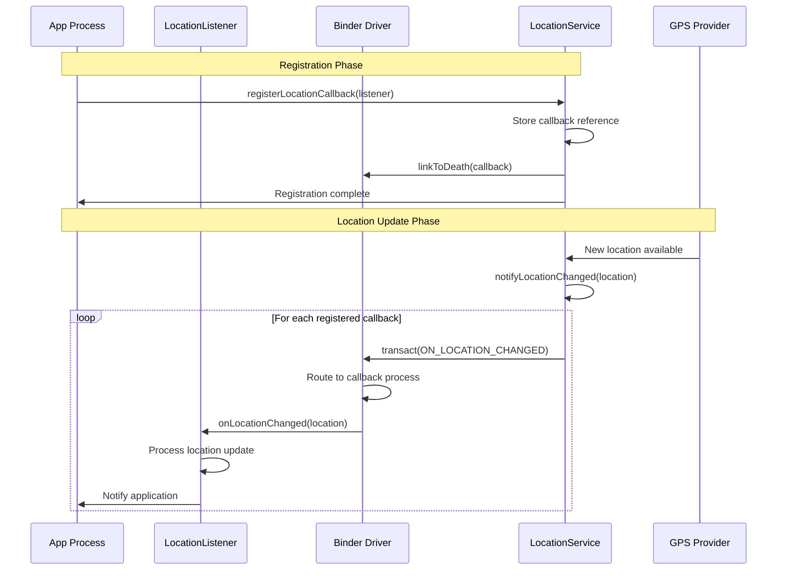
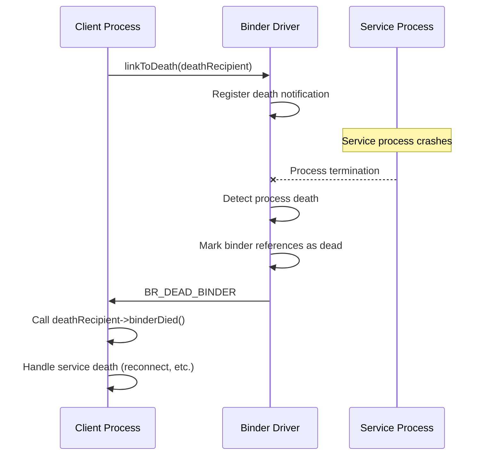

# Binder IPC Deep Dive - Android Open Source Project

## Table of Contents
1. [Introduction](#introduction)
2. [Binder IPC Model](#binder-ipc-model)
3. [Architecture Components](#architecture-components)
4. [Communication Flow](#communication-flow)
5. [Example Flows](#example-flows)
6. [Implementation Details](#implementation-details)
7. [Performance Characteristics](#performance-characteristics)
8. [Best Practices](#best-practices)

## Introduction

**Binder** is Android's primary Inter-Process Communication (IPC) mechanism, designed specifically for efficient communication between Android applications and system services. Unlike traditional IPC mechanisms, Binder provides object-oriented RPC (Remote Procedure Call) with built-in security, reference counting, and death notification.

**Key Features:**
- **Single Copy**: Data is copied only once during transmission
- **Security**: Built-in permission checking and UID/PID verification
- **Object References**: Direct object reference passing between processes
- **Death Notification**: Automatic cleanup when processes die
- **Thread Pool Management**: Efficient thread allocation for service handling

## Binder IPC Model

### High-Level Architecture

```
┌─────────────────┐    ┌─────────────────┐    ┌─────────────────┐
│   Client App    │    │  Binder Driver  │    │ Service Process │
│                 │    │   (Kernel)      │    │                 │
│ ┌─────────────┐ │    │                 │    │ ┌─────────────┐ │
│ │   Proxy     │ │◄──►│  Binder Node    │◄──►│ │   Binder    │ │
│ │  (IBinder)  │ │    │   Management    │    │ │  (Native)   │ │
│ └─────────────┘ │    │                 │    │ └─────────────┘ │
│                 │    │ ┌─────────────┐ │    │                 │
│ ┌─────────────┐ │    │ │Transaction  │ │    │ ┌─────────────┐ │
│ │Service Mgr  │ │    │ │   Buffer    │ │    │ │Service Mgr  │ │
│ │   Proxy     │ │    │ │             │ │    │ │  Native     │ │
│ └─────────────┘ │    │ └─────────────┘ │    │ └─────────────┘ │
└─────────────────┘    └─────────────────┘    └─────────────────┘
     User Space              Kernel Space           User Space
```

### Core Components

#### 1. **Binder Driver** (`/dev/binder`)
- **Location**: Kernel space
- **Responsibilities**:
  - Message routing between processes
  - Memory management (single copy)
  - Security enforcement
  - Death notification
  - Reference counting

#### 2. **Service Manager**
- **Location**: Native daemon process
- **Responsibilities**:
  - Service registration and discovery
  - Permission checking
  - Service lifecycle management

#### 3. **Binder Library** (`libbinder.so`)
- **Location**: User space
- **Responsibilities**:
  - Proxy/Stub generation
  - Marshaling/Unmarshaling
  - Thread pool management
  - Transaction handling

## Architecture Components

### Binder Object Hierarchy

```cpp
// Core Binder Interface
class IBinder {
public:
    virtual status_t transact(uint32_t code, 
                             const Parcel& data,
                             Parcel* reply, 
                             uint32_t flags = 0) = 0;
    virtual sp<IInterface> queryInterface(const String16& descriptor) = 0;
};

// Binder Implementation (Service Side)
class BBinder : public IBinder {
public:
    virtual status_t onTransact(uint32_t code,
                               const Parcel& data,
                               Parcel* reply,
                               uint32_t flags = 0);
};

// Binder Proxy (Client Side)
class BpBinder : public IBinder {
    handle_t mHandle;  // Reference to remote object
public:
    virtual status_t transact(uint32_t code,
                             const Parcel& data,
                             Parcel* reply,
                             uint32_t flags = 0);
};
```

### Service Interface Definition

```cpp
// Interface Definition (AIDL generates this)
class IMyService : public IInterface {
public:
    DECLARE_META_INTERFACE(MyService);
    
    virtual status_t doSomething(int32_t param, String16* result) = 0;
    virtual status_t registerCallback(const sp<IMyCallback>& callback) = 0;
};

// Service Implementation
class BnMyService : public BnInterface<IMyService> {
public:
    virtual status_t onTransact(uint32_t code,
                               const Parcel& data,
                               Parcel* reply,
                               uint32_t flags = 0);
};

// Client Proxy
class BpMyService : public BpInterface<IMyService> {
public:
    virtual status_t doSomething(int32_t param, String16* result) {
        Parcel data, reply;
        data.writeInt32(param);
        status_t err = remote()->transact(DO_SOMETHING, data, &reply);
        if (err == NO_ERROR) {
            reply.readString16(result);
        }
        return err;
    }
};
```

## Communication Flow

### 1. Service Registration Flow



### 2. Service Discovery Flow



### 3. Transaction Flow



## Example Flows

### Example 1: App Calling System Service

**Scenario**: App requests current time from System Server

```cpp
// 1. Client Side (App Process)
class TimeClient {
    sp<ISystemService> mService;
    
public:
    void getCurrentTime() {
        // Get service manager
        sp<IServiceManager> sm = defaultServiceManager();
        
        // Get system service
        sp<IBinder> binder = sm->getService(String16("system"));
        mService = interface_cast<ISystemService>(binder);
        
        // Call service method
        int64_t currentTime;
        status_t err = mService->getCurrentTime(&currentTime);
        
        if (err == NO_ERROR) {
            ALOGD("Current time: %lld", currentTime);
        }
    }
};

// 2. Service Side (System Server Process)
class SystemService : public BnSystemService {
public:
    virtual status_t getCurrentTime(int64_t* outTime) {
        *outTime = systemTime(SYSTEM_TIME_REALTIME);
        return NO_ERROR;
    }
    
    virtual status_t onTransact(uint32_t code,
                               const Parcel& data,
                               Parcel* reply,
                               uint32_t flags) {
        switch (code) {
            case GET_CURRENT_TIME: {
                CHECK_INTERFACE(ISystemService, data, reply);
                int64_t time;
                status_t err = getCurrentTime(&time);
                reply->writeInt64(time);
                return err;
            }
        }
        return BBinder::onTransact(code, data, reply, flags);
    }
};

// 3. Generated Proxy (AIDL)
class BpSystemService : public BpInterface<ISystemService> {
public:
    virtual status_t getCurrentTime(int64_t* outTime) {
        Parcel data, reply;
        data.writeInterfaceToken(ISystemService::getInterfaceDescriptor());
        
        status_t err = remote()->transact(GET_CURRENT_TIME, data, &reply);
        if (err == NO_ERROR) {
            *outTime = reply.readInt64();
        }
        return err;
    }
};
```

**Flow Sequence:**



### Example 2: Service Notifying Changes via Callback

**Scenario**: Location service notifying apps about location changes

```cpp
// 1. Callback Interface Definition
class ILocationCallback : public IInterface {
public:
    DECLARE_META_INTERFACE(LocationCallback);
    virtual void onLocationChanged(const Location& location) = 0;
};

// 2. Client Implementation
class LocationListener : public BnLocationCallback {
public:
    virtual void onLocationChanged(const Location& location) override {
        ALOGD("Location changed: lat=%f, lng=%f", 
              location.latitude, location.longitude);
        // Update UI or notify app
    }
};

class AppLocationClient {
    sp<ILocationService> mLocationService;
    sp<LocationListener> mListener;
    
public:
    void startLocationUpdates() {
        // Get location service
        sp<IServiceManager> sm = defaultServiceManager();
        sp<IBinder> binder = sm->getService(String16("location"));
        mLocationService = interface_cast<ILocationService>(binder);
        
        // Create callback
        mListener = new LocationListener();
        
        // Register for updates
        mLocationService->registerLocationCallback(mListener);
    }
};

// 3. Service Implementation
class LocationService : public BnLocationService {
    Vector<sp<ILocationCallback>> mCallbacks;
    
public:
    virtual status_t registerLocationCallback(const sp<ILocationCallback>& callback) {
        mCallbacks.push_back(callback);
        
        // Set up death notification
        sp<IBinder> binder = IInterface::asBinder(callback);
        binder->linkToDeath(this);
        
        return NO_ERROR;
    }
    
    void notifyLocationChanged(const Location& location) {
        // Notify all registered callbacks
        for (size_t i = 0; i < mCallbacks.size(); i++) {
            sp<ILocationCallback> callback = mCallbacks[i];
            if (callback != nullptr) {
                callback->onLocationChanged(location);
            }
        }
    }
    
    virtual void binderDied(const wp<IBinder>& who) {
        // Remove dead callback
        sp<IBinder> binder = who.promote();
        if (binder != nullptr) {
            removeCallback(binder);
        }
    }
};
```

**Callback Flow Sequence:**



### Example 3: Death Notification Flow

**Scenario**: Service process crashes, clients get notified

```cpp
// Client side death recipient
class ServiceDeathRecipient : public IBinder::DeathRecipient {
public:
    virtual void binderDied(const wp<IBinder>& who) override {
        ALOGW("Service died, attempting reconnection...");
        // Reconnect to service
        reconnectToService();
    }
};

// Usage
class ClientApp {
    sp<IMyService> mService;
    sp<ServiceDeathRecipient> mDeathRecipient;
    
public:
    void connectToService() {
        sp<IServiceManager> sm = defaultServiceManager();
        sp<IBinder> binder = sm->getService(String16("my_service"));
        mService = interface_cast<IMyService>(binder);
        
        // Set up death notification
        mDeathRecipient = new ServiceDeathRecipient();
        binder->linkToDeath(mDeathRecipient);
    }
};
```

**Death Notification Sequence:**



## Implementation Details

### Memory Management

```cpp
// Binder uses single-copy semantics
class Parcel {
    uint8_t* mData;        // Data buffer
    size_t mDataSize;      // Current data size
    size_t mDataCapacity;  // Buffer capacity
    
    // Objects (IBinder references)
    binder_size_t* mObjects;
    size_t mObjectsSize;
    size_t mObjectsCapacity;
    
public:
    status_t writeStrongBinder(const sp<IBinder>& val) {
        return flatten_binder(ProcessState::self(), val, this);
    }
    
    sp<IBinder> readStrongBinder() const {
        return unflatten_binder(ProcessState::self(), *this);
    }
};
```

### Transaction Structure

```cpp
struct binder_transaction_data {
    union {
        __u32 handle;      // Target handle (for proxy)
        binder_uintptr_t ptr; // Target pointer (for local)
    } target;
    
    binder_uintptr_t cookie;    // Target cookie
    __u32 code;                 // Transaction code
    __u32 flags;                // Transaction flags
    
    pid_t sender_pid;           // Sender process ID
    uid_t sender_euid;          // Sender effective UID
    
    binder_size_t data_size;    // Data buffer size
    binder_size_t offsets_size; // Object offsets size
    
    union {
        struct {
            binder_uintptr_t buffer;  // Data buffer
            binder_uintptr_t offsets; // Object offsets
        } ptr;
        __u8 buf[8];
    } data;
};
```

### Thread Pool Management

```cpp
class ProcessState {
    static const size_t DEFAULT_MAX_BINDER_THREADS = 15;
    
    mutable Mutex mLock;
    Vector<String16> mManifestPkg;
    
    int mDriverFD;                    // Binder driver file descriptor
    void* mVMStart;                   // VM mapping start
    size_t mMmapSize;                 // Memory map size
    
    mutable Mutex mThreadCountLock;
    size_t mMaxThreads;               // Maximum thread count
    size_t mCurrentThreads;           // Current thread count
    
public:
    void startThreadPool() {
        AutoMutex _l(mLock);
        if (!mThreadPoolStarted) {
            mThreadPoolStarted = true;
            spawnPooledThread(true);
        }
    }
    
    void joinThreadPool(bool isMain = true) {
        LOG_THREADPOOL("**** THREAD %p (PID %d) IS JOINING THE THREAD POOL\n", 
                      (void*)pthread_self(), getpid());
        
        mOut.writeInt32(isMain ? BC_ENTER_LOOPER : BC_REGISTER_LOOPER);
        
        status_t result;
        do {
            result = getAndExecuteCommand();
        } while (result != -ECONNREFUSED && result != -EBADF);
        
        mOut.writeInt32(BC_EXIT_LOOPER);
        talkWithDriver(false);
    }
};
```

## Performance Characteristics

### Benchmark Comparisons

| IPC Mechanism | Latency (μs) | Throughput (MB/s) | CPU Usage |
|---------------|--------------|-------------------|-----------|
| Binder        | 25-50        | 100-200          | Low       |
| Unix Socket   | 100-200      | 50-100           | Medium    |
| Shared Memory | 5-10         | 500-1000         | Very Low  |
| Intent        | 200-500      | 10-50            | High      |

### Memory Usage

```cpp
// Single-copy data transfer
// Traditional: App → Kernel → Service (2 copies)
// Binder: App → Kernel (mapped to Service) (1 copy)

struct binder_buffer {
    void* data;              // Shared between processes
    size_t data_size;        // Buffer size
    size_t offsets_size;     // Object reference count
    
    // No additional copy needed for service
    // Data is directly accessible in service address space
};
```

### Security Model

```cpp
// Permission checking in service
status_t MyService::onTransact(uint32_t code, const Parcel& data, 
                              Parcel* reply, uint32_t flags) {
    // Check caller permissions
    if (!checkCallingPermission(String16("android.permission.ACCESS_SERVICE"))) {
        ALOGE("Permission denied for caller PID=%d UID=%d", 
              IPCThreadState::self()->getCallingPid(),
              IPCThreadState::self()->getCallingUid());
        return PERMISSION_DENIED;
    }
    
    switch (code) {
        case SENSITIVE_OPERATION:
            // Additional security checks
            if (IPCThreadState::self()->getCallingUid() != AID_SYSTEM) {
                return PERMISSION_DENIED;
            }
            break;
    }
    
    return BnMyService::onTransact(code, data, reply, flags);
}
```

## Best Practices

### 1. Interface Design

```cpp
// Good: Simple, focused interface
interface ILocationService {
    void requestLocationUpdates(in LocationRequest request, 
                               in ILocationCallback callback);
    void removeLocationUpdates(in ILocationCallback callback);
    Location getLastKnownLocation();
}

// Avoid: Complex, chatty interface
// interface IBadService {
//     void setProperty1(String value);
//     String getProperty1();
//     void setProperty2(int value);
//     int getProperty2();
//     // ... many small methods
// }
```

### 2. Error Handling

```cpp
class RobustServiceClient {
    sp<IMyService> mService;
    sp<DeathRecipient> mDeathRecipient;
    
public:
    status_t callService() {
        if (mService == nullptr) {
            status_t err = connectToService();
            if (err != NO_ERROR) return err;
        }
        
        status_t err = mService->doOperation();
        if (err == DEAD_OBJECT) {
            // Service died, try to reconnect
            mService = nullptr;
            return connectToService();
        }
        
        return err;
    }
};
```

### 3. Threading Considerations

```cpp
// Service implementation with proper threading
class ThreadSafeService : public BnMyService {
    mutable Mutex mLock;
    
public:
    virtual status_t getValue(int32_t* outValue) {
        AutoMutex _l(mLock);
        *outValue = mInternalValue;
        return NO_ERROR;
    }
    
    virtual status_t setValue(int32_t value) {
        AutoMutex _l(mLock);
        mInternalValue = value;
        return NO_ERROR;
    }
};
```

### 4. Resource Management

```cpp
// Proper cleanup in service
class ResourceManagedService : public BnMyService {
    KeyedVector<sp<IBinder>, sp<Resource>> mClientResources;
    
public:
    virtual status_t allocateResource(sp<IResourceCallback>& callback) {
        sp<IBinder> binder = IInterface::asBinder(callback);
        
        // Set up death notification for cleanup
        binder->linkToDeath(this);
        
        sp<Resource> resource = new Resource();
        mClientResources.add(binder, resource);
        
        return NO_ERROR;
    }
    
    virtual void binderDied(const wp<IBinder>& who) {
        sp<IBinder> binder = who.promote();
        if (binder != nullptr) {
            ssize_t index = mClientResources.indexOfKey(binder);
            if (index >= 0) {
                sp<Resource> resource = mClientResources.valueAt(index);
                resource->cleanup();
                mClientResources.removeItemsAt(index);
            }
        }
    }
};
```

## Conclusion

Binder IPC is a sophisticated, high-performance communication mechanism that forms the backbone of Android's service architecture. Its design provides:

- **Efficiency**: Single-copy data transfer and optimized memory management
- **Security**: Built-in permission checking and process isolation
- **Reliability**: Death notification and automatic cleanup
- **Scalability**: Thread pool management and asynchronous operations

Understanding Binder is crucial for Android system development, as it enables robust communication between applications and system services while
